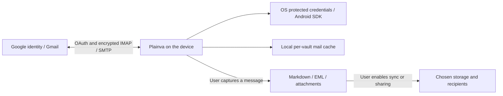

# Native Google mail

Status: implemented behind explicit native test-client configuration; registration, live consent and provider verification are not claimed. Updated 2026-09-14.

Gmail uses the existing reader, compose window, capture actions and account registry. `kind: "gmail"` selects IMAP/SMTP with XOAUTH2. Historical `kind: "imap"` accounts retain their app-password login. Connecting Gmail OAuth does not convert password accounts. A confirmed account can add files or calendars while preserving narrower grants. See [account grants](Account_Grants.md).

## Native registration

| Platform | Registration and return | Renewal |
| --- | --- | --- |
| Windows, macOS, Linux | Desktop client; system browser, PKCE S256, random state and ephemeral loopback listener | Device-local refresh token through the broker |
| iOS | iOS client, bundle `com.plainva.app`; browser return `com.plainva.app:/oauth2redirect`, PKCE S256 and state | Protected refresh token and durable received-consent record |
| Android | Android client, package `com.plainva.app`, installed build's signing SHA-1; Google Identity Services 22.0.0 | Play services owns renewal; Plainva stores verified identity and actual scopes, without a fabricated refresh token |

Android uses `AuthorizationClient` for Gmail, Drive and Calendar. Background access never opens consent. A rejected access token is cleared from the SDK cache before renewal. The SDK identifies the installed app through package and signing certificate; typing a different client ID does not change that native identity. A registration for an unrelated package, certificate or project cannot substitute. Google no longer supports Android custom URI redirects. Desktop client values belong to an installed application, not a confidential web backend. [Google native OAuth](https://developers.google.com/identity/protocols/oauth2/native-app), [Android authorization](https://developer.android.com/identity/authorization).

## Test configuration

No client IDs are shipped by this change. `googlePublicClient.ts` exposes the entry only when required values exist and `VITE_PLAINVA_GOOGLE_MAIL_STATE=testing`. Other states, including `production`, keep it hidden. The button and notice explicitly describe test access.

| Input | Meaning |
| --- | --- |
| `VITE_PLAINVA_GOOGLE_MAIL_STATE` | `testing` for the registered test client |
| `VITE_PLAINVA_GOOGLE_DESKTOP_CLIENT_ID` | Desktop client ID |
| `VITE_PLAINVA_GOOGLE_DESKTOP_CLIENT_SECRET` | Matching installed Desktop client value |
| `VITE_PLAINVA_GOOGLE_IOS_CLIENT_ID` | iOS client ID |
| `VITE_PLAINVA_GOOGLE_ANDROID_CLIENT_ID` | Android client ID matching package and certificate |

For local builds use the shell's ignored `.env.local` or its build environment; never commit a populated environment file. Mobile workflows accept state and platform client ID as repository variables. Unset values leave the entry disabled. Build-cache inputs include these values. Production activation requires registration, reviewed disclosure, provider decision and a separate source change.

## Permissions and data

IMAP/SMTP requires `https://mail.google.com/`; `openid email` supports verified account matching. Plainva checks the returned scope and authenticated user-info response, then probes IMAP. Narrow Gmail API scopes cannot authorize this protocol connection. Google's Gmail API guidance also requires justification for this broad scope, including permanent-deletion functionality. Submission must show actual actions and protocol; protocol choice alone does not establish approval. [XOAUTH2](https://developers.google.com/workspace/gmail/imap/xoauth2-protocol), [Gmail scopes](https://developers.google.com/workspace/gmail/api/auth/scopes).

The HTTP bridge is embedded in the installed app. No Plainva mail proxy, token server or Gmail indexing service is introduced. Offline reading stores envelopes and recently viewed bodies in the per-vault index (`mailCache.ts`, up to 200 bodies). Compose and the send-delay queue hold outgoing content. Sending transfers it through Gmail to addressed recipients. Loading external images remains a separate user choice and can contact sender-controlled hosts.

Capture writes Markdown or raw EML through the vault adapter; attachments can be saved as files. These follow the vault's storage, backup, export, publication, sharing and sync settings. Removing an account does not erase intentionally captured notes or copies already held by recipients. Users can also revoke access in Google account settings. OAuth credentials and Android renewal metadata are installation-local, excluded from profiles and the credentials sideband. Existing optional password sync remains separate for password accounts.

Restricted-data assessment must consider user-selected server destinations too. No exemption is inferred from local authentication or absence of a Plainva backend. Published disclosure and submission must describe access, storage, sharing and retention consistently. [Restricted-scope verification](https://developers.google.com/identity/protocols/oauth2/production-readiness/restricted-scope-verification), [User-data policy](https://developers.google.com/terms/api-services-user-data-policy).

## Failure boundaries

Batch mutations, UID verification and attachment metadata use the shared [mail action contract](Mail_Batch_Actions.md).

The broker selects by account, client and service, checks scopes after renewal and protects credential changes with compare-and-set. Wrong identity, incomplete consent and cancellation preserve existing access. Stable Gmail connection IDs allow retry after an interrupted mailbox/registry write. Mobile received-consent records are replayable until their ten-minute expiry; expiry requires consent again without deleting existing accounts.

XOAUTH2 never falls back to a password mechanism. OAuth rejection can renew once and retry authentication; a disconnect after SMTP DATA is not automatically replayed. Google tokens are restricted to Gmail IMAP/SMTP hosts. ManageSieve is not offered for Gmail; both transports reject OAuth credentials before opening a Sieve connection. Authentication errors use a constant code, excluding reflected credentials from displayed errors.

Automated coverage includes protocol success/rejection, challenge acknowledgement, changed servers, expired grants, account isolation, interrupted storage, mobile cold return and preservation of legacy passwords. Windows Rust and Android Java compilation are distinct from live Google consent. Native iOS compilation runs in the mobile delivery workflow.
